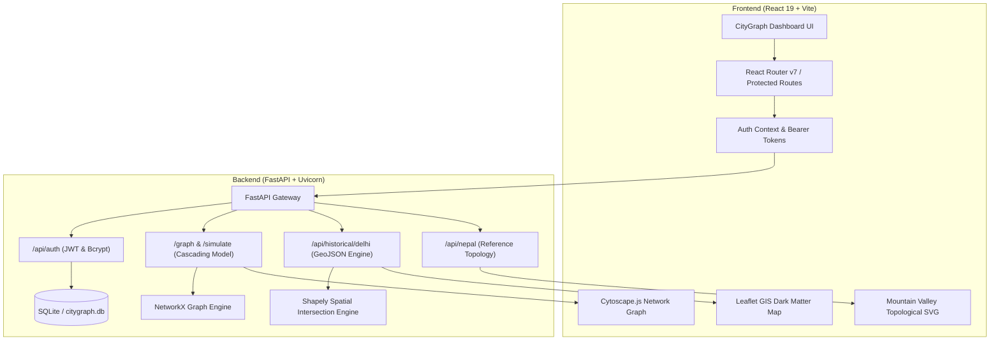

# CityGraph — Urban Infrastructure Risk Intelligence

> **Predictive cascading-failure simulation, historical flood replay, and resilient emergency routing for municipal operations.**

[](https://fastapi.tiangolo.com)
[](https://react.dev)
[](https://vitejs.dev)
[](https://networkx.org)
[](https://leafletjs.com)
[](LICENSE)

---

## 📌 Problem Statement

Modern cities operate as tightly coupled, interdependent networks. When severe weather events—such as cloudbursts, riverbank overspills, or flash floods—strike an urban center:
- **Drainage pump stations fail** due to stormwater backflow surcharge and power loss.
- **Surface runoff propagates** into adjacent arterial underpasses and road corridors.
- **Emergency services become severed** when access roads leading to trauma hospitals and fire headquarters are submerged.

Traditional municipal emergency dashboards present siloed maps or raw tabular sensor feeds that fail to anticipate **how failure in one sector cascades into another**. CityGraph solves this by unifying graph theory, spatial GIS, and hydraulic stress modeling into an actionable decision-support platform for incident commanders and urban resilience teams.

---

## 🚀 Key Features

CityGraph provides three specialized, isolated operational environments:

### 1. Synthetic Delhi Infrastructure Network
- **Topological Graph Representation**: Models 70 municipal assets (Level-1 trauma hospitals, fire dispatch headquarters, stormwater pumping stations, 220kV power substations, and arterial road corridors) with 113 bidirectional connections.
- **Dynamic Cascading-Failure Simulation**: Simulates a 90mm/hr monsoon cloudburst using NetworkX. Models hydraulic overload across drainage regulators, propagating secondary road inundation and tertiary risk to surrounding transit lifelines.
- **Asset Diagnostic Inspector**: Interactive Cytoscape graph inspection showing live capacity ratios, failure diagnostics, failure reasons, and connected corridors.
- **Algorithmic Emergency Route Solver**: Dynamically calculates Dijkstra-weighted safe corridors (e.g., AIIMS Trauma Center $\rightarrow$ Delhi Fire HQ) that steer emergency response vehicles away from flooded intersections.

### 2. Delhi Historical Flood Replay (July 2023)
- **Validated Event Replay**: Reconstructs the historic July 10–16, 2023 Yamuna River flood in New Delhi, where river levels crested at an all-time record **208.66m** (3.33m above danger level).
- **Interactive Chronological Timeline**: Scrub through 7 distinct days to watch water inundate Monastery Market, Kashmere Gate ISBT, and the critical ITO Drain #12 regulator breach.
- **GIS Geospatial Analysis**: Leaflet-powered Dark Matter base map overlaying geojson flood polygons and submerged arterial corridors.
- **Historical Ridge Detour**: Displays the calculated 6.8 km high-ground detour through Rani Jhansi Road and Ridge Road, bypassing inundated Ring Road segments.
- *Clearly demarcated with the mandatory notice: `HISTORICAL REFERENCE DATA • NOT FOR LIVE EMERGENCY USE`.*

### 3. Nepal Flash-Flood Reference Scenario
- **Steep-Terrain Mountain Valley Model**: Illustrates high-gradient glacial/monsoon flash flooding across 12 reference assets arranged in three distinct elevation bands (Valley Floor, Mid-Slope, High Ridge).
- **Topological Schematic**: Interactive SVG visualization featuring torrential riverbed surges, debris-flow road blockages, submerged hydropower intake facilities, and broken suspension footbridges.
- **High-Ridge Evacuation Corridor**: Demonstrates safe uphill evacuation (+480m ascent) steering valley-floor inhabitants to the elevated Rescue Command Base and Summit Emergency Helipad.
- *Explicitly badged with: `SIMULATED REFERENCE MODEL • NOT AN OFFICIAL OR LIVE MONITORING FEED`.*

### 4. Enterprise Security & Session Management
- **Role-Based Authentication**: Secure JWT (HS256) bearer token authentication backed by SQLite and bcrypt password hashing.
- **Incident Commander Demo Profile**: Out-of-the-box pre-seeded demo credential button for instant walkthroughs (`admin@citygraph.org` / `password123`).

---

## 🏗️ System Architecture



---

## 🛠️ Technology Stack

| Layer | Technologies |
| :--- | :--- |
| **Backend Core** | Python 3.11+, FastAPI, Uvicorn, Pydantic v2 |
| **Graph & Spatial Analysis** | NetworkX (Shortest path, risk-weighted graphs), Shapely (Point/Line in Polygon GIS) |
| **Authentication & Database** | SQLAlchemy ORM, SQLite, PyJWT, Bcrypt |
| **Frontend Framework** | React 19, Vite 8, React Router v7 |
| **Visualizations** | Cytoscape.js (Topology canvas), Leaflet 1.9 (Geospatial maps), Custom Responsive SVG |
| **Code Quality & Tooling** | Oxlint, ES6 Modules, Modern CSS Custom Properties |

---

## ⚙️ Installation & Setup

### Prerequisites
- **Python 3.11+**
- **Node.js 18+** and **npm**
- **Git**

### 1. Clone Repository
```bash
git clone <YOUR_REPOSITORY_URL>
cd citygraph
```

### 2. Backend Setup
```bash
# Navigate to backend folder
cd backend

# Create Python virtual environment
python -m venv .venv

# Activate virtual environment
# Windows (PowerShell):
.\.venv\Scripts\Activate.ps1
# macOS/Linux:
# source .venv/bin/activate

# Install required dependencies
pip install -r requirements.txt

# (Optional) Configure environment variables
# Copy .env.example if you wish to customize port or secret keys
cp .env.example .env
```

### 3. Frontend Setup
```bash
# From the project root, navigate to frontend
cd ../frontend

# Install dependencies
npm install
```

---

## 🖥️ Running the Application

### Start Backend API Server
In your backend terminal (with `.venv` activated):
```bash
cd backend
python -m uvicorn main:app --host 127.0.0.1 --port 8000 --reload
```
- API Health: `http://127.0.0.1:8000/api/health`
- Interactive Swagger API Docs: `http://127.0.0.1:8000/docs`

### Start Frontend Client
In a separate terminal:
```bash
cd frontend
npm run dev
```
Open your browser at `http://localhost:5173/` (or the port Vite prints in your terminal, e.g. `http://localhost:5175/`).

### Demo Login Credentials
- **Email / Username**: `admin@citygraph.org` (or `admin`)
- **Password**: `password123`
- **Role**: *Incident Commander (City Operations Lead)*
- *(Or click the **"Fill Demo Admin Credentials"** button on the login screen).*

---

## 📡 API Endpoints Overview

| Method | Endpoint | Auth | Description |
| :--- | :--- | :--- | :--- |
| `GET` | `/api/health` | Public | System health check |
| `POST` | `/api/auth/register` | Public | Register a new user account |
| `POST` | `/api/auth/login` | Public | Login and receive JWT access token |
| `GET` | `/api/auth/me` | Bearer | Current user profile |
| `GET` | `/graph` | Bearer | Fetch baseline synthetic network graph |
| `POST` | `/simulate/heavy-rain` | Bearer | Run 90mm/hr cascading-failure simulation |
| `POST` | `/reset` | Bearer | Reset simulation to normal baseline state |
| `GET` | `/api/historical/delhi/metadata` | Bearer | Delhi July 2023 flood event overview |
| `GET` | `/api/historical/delhi/timeline` | Bearer | Day-by-day water level and event progression |
| `GET` | `/api/historical/delhi/flood-layer` | Bearer | Inundated zones GeoJSON polygon layer |
| `GET` | `/api/historical/delhi/roads` | Bearer | Road network status (passable vs submerged) |
| `GET` | `/api/historical/delhi/safe-route` | Bearer | Safe detour routing avoiding submerged corridors |
| `GET` | `/api/nepal/metadata` | Bearer | Nepal reference scenario metadata & disclaimers |
| `GET` | `/api/nepal/topology` | Bearer | 12 reference assets and elevation coordinates |
| `GET` | `/api/nepal/evacuation-route`| Bearer | High-ridge safe extraction corridor |
| `GET` | `/api/nepal/timeline` | Bearer | 4-phase flash-flood progression timeline |

---

## ⚠️ Simulation Limitations & Disclaimers

1. **Synthetic Delhi Simulation**:
   - The Synthetic Delhi network uses a graph-theoretic heuristic load-transfer model rather than complete 2D Saint-Venant hydraulic hydrodynamic equations.
   - Asset names and links represent synthetic illustrative metadata for testing cascading dependencies.
2. **Delhi Historical Flood Replay**:
   - Flood extent polygons and road inundation classifications are reconstructed for demonstration and operational reference from July 2023 media reports, satellite flood assessments, and government bulletins. They should not be used as an active real-time life-safety navigation tool.
3. **Nepal Reference Scenario**:
   - Strictly an illustrative reference model for steep mountain topography. It does not claim live sensor feeds or precise survey coordinates for specific Himalayan river basins.

---

## 🔮 Future Roadmap & Improvements

- [ ] **Live Telemetry Ingestion**: Direct MQTT/REST webhooks connecting Central Water Commission (CWC) river gauges and municipal SCADA pump sensors.
- [ ] **Weather Radar Integration**: Ingestion of real-time Doppler weather radar feeds (IMD/NOAA) for dynamic rainfall intensity inputs.
- [ ] **Multimodal Route Optimization**: Integration of real-time traffic speeds (OSRM/Valhalla) alongside flood depth impedances.
- [ ] **3D Digital Elevation Models**: Three-dimensional terrain mesh visualization using Deck.gl and MapLibre GL.
- [ ] **Incident Response Collaboration**: Multi-user live incident room with shared whiteboard annotations and dispatch orders.

---

## 📄 License

This project is licensed under the MIT License — see the [LICENSE](LICENSE) file for details.
